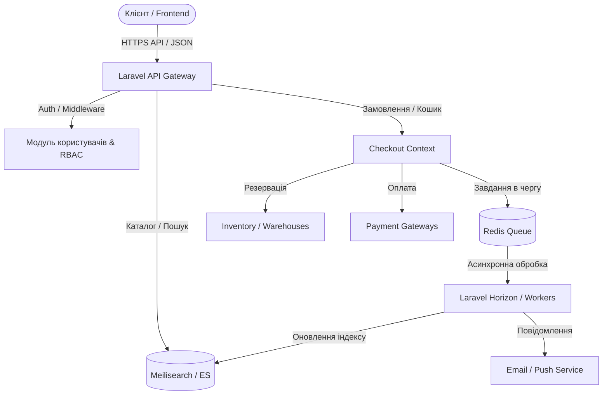

# Архітектурна дорожня карта розвитку FilkxTech E-commerce 🏗️

Цей документ описує повну структуру та покроковий план побудови високонавантаженої та масштабованої e-commerce платформи **FilkxTech** (Laravel API-first + Vue.js/Nuxt). 
Він розділений на логічні етапи із чітким маркуванням того, що вже реалізовано, а що заплановано до розробки.

---

## 🗺️ Загальна архітектура системи



---

## 📊 Поточний статус системи (Аудит коду)

### 1. Бекенд (Laravel API)
* **Безпека та Користувачі:**
  * `[x]` Базова таблиця користувачів (`User`), локалізація та часові пояси.
  * `[x]` Інтеграція OAuth (OAuth клієнти, авторизаційні коди, акаунти користувачів).
  * `[x]` Рольова модель (RBAC: `roles`, `permissions`, `permission_role`, `role_user`).
  * `[x]` Логування дій безпеки (`audit_logs`, `permission_changes_log`).
  * `[x]` Налаштування сповіщень у профілях користувачів.
* **Підтримка:**
  * `[x]` Система тікетів підтримки (`support_tickets`, `support_messages`).
  * `[x]` Загальні налаштування системи (`settings`).
* **E-commerce домен (Відсутній):**
  * `[ ]` Каталог товарів (Бренди, Категорії, Атрибути, Товари, Варіанти).
  * `[ ]` Склади та залишки (Inventory/Stock).
  * `[ ]` Ціноутворення та акції (Prices/Discounts).
  * `[ ]` Замовлення, Кошик та Оплата (Orders/Checkout).
  * `[ ]` Черги, Пошуковий двигун (Meilisearch) та CDN.

### 2. Фронтенд (Vue.js SPA)
* **Дизайн та Компоненти:**
  * `[x]` Преміальний дизайн домашньої сторінки (Hero, Categories, FlashDeals, Recommended, USP, TechBlog).
  * `[x]` Адаптивний хедер з пошуковим рядком, розширеним каталогом та навігацією.
  * `[x]` Сучасний та повний футер з інформаційними блоками.
  * `[x]` Кабінет користувача (`UserCabinetPage`) з вкладками Замовлень, Обраного, Налаштувань та Підтримки.
  * `[x]` Картки товарів з підтримкою варіативності, відгуків та знижок.
  * `[x]` Покращене модальне вікно "Швидкого огляду" (з характеристиками, вибором кольору, списком особливостей та вибором кількості).
  * `[x]` Керування кошиком, порівнянням та списком бажаного через клієнтський стор Pinia/Vue.
* **Інтеграція (Відсутня):**
  * `[ ]` Зв'язок клієнтських компонентів з реальними API бекенду (наразі використовуються демо-дані на фронтенді).
  * `[ ]` Збереження стану кошика та обраного у LocalStorage.
  * `[ ]` Повноцінний процес Checkout.

---

## 🛠️ Детальний план реалізації (Stage-by-Stage)

### 📌 ЕТАП 1: Базовий Каталог, Склади та Кошик (Core Commerce)

> **Мета:** Створити фундамент бази даних, API для виведення товарів та синхронізувати фронтенд з бекендом.

#### 1. База даних та міграції (Бекенд)
* `[ ]` Створення таблиць каталогів:
  * `categories` (з підтримкою рекурсивного дерева / Nested Set).
  * `brands` (бренд, логотип, опис).
  * `products` (загальний опис, статус, SEO, бренд).
  * `product_variants` (SKU, штрихкод, ціна, вага, розміри).
* `[ ]` Створення таблиць атрибутів (EAV паттерн):
  * `attributes` (назва, тип: select, color, number тощо).
  * `attribute_values` (значення атрибуту).
  * `product_attribute_values` (зв'язок варіанту чи товару з атрибутом).
* `[ ]` Таблиця складів та залишків:
  * `warehouses` (склади).
  * `stocks` (фізичні залишки варіантів на складах).
  * `stock_reservations` (тимчасове резервування під час оформлення кошика).

#### 2. REST API (Бекенд)
* `[ ]` `GET /api/v1/catalog/categories` — отримання дерева категорій.
* `[ ]` `GET /api/v1/catalog/products` — фільтрація та лістинг товарів (з пагінацією).
* `[ ]` `GET /api/v1/catalog/products/{slug}` — детальна сторінка товару з варіантами.
* `[ ]` `POST /api/v1/cart/sync` — синхронізація кошика клієнта з базою даних.

#### 3. Інтеграція фронтенду
* `[ ]` Заміна статичних масивів у `HeroSlider`, `FlashDeals`, `RecommendedProducts` та `CategoriesGrid` на запити до API через Axios.
* `[ ]` Реалізація персистенції кошика та обраного (LocalStorage + синхронізація при логіні).

---

### 📌 ЕТАП 2: Ціни, Промо-акції та Оформлення Замовлень (Checkout & Order Management)

> **Мета:** Додати логіку гнучких цін, знижок, оформлення замовлення, інтеграції з платіжними системами.

#### 1. Модуль Ціноутворення (Pricing & Discounts)
* `[ ]` Створення таблиці `prices` для зберігання базових, оптових та акційних цін з прив'язкою до дат дії.
* `[ ]` Створення таблиць купонів (`coupons`) та промо-правил (`promotion_rules`).
* `[ ]` Реалізація сервісу розрахунку фінальної ціни варіанту товару (`PriceCalculationService`) на основі активних промо-акцій.

#### 2. Замовлення та Checkout (Checkout Bounded Context)
* `[ ]` Створення таблиць `orders`, `order_items`, `transactions` та `shipments`.
* `[ ]` Створення API для оформлення замовлення:
  * `POST /api/v1/checkout/validate` — перевірка залишків, купонів та розрахунок вартості доставки.
  * `POST /api/v1/checkout/submit` — списання залишків, створення замовлення та транзакції.
* `[ ]` Інтеграція платіжного шлюзу (Monobank, LiqPay або Stripe).
* `[ ]` Зв'язування вкладки «Мої замовлення» в `UserCabinetPage` з бекенд API.

---

### 📌 ЕТАП 3: Швидкий Пошук, Медіа-система та Черги (Enterprise Architecture)

> **Мета:** Оптимізація продуктивності, підключення пошукового двигуна, робота з чергами та медіа-файлами.

#### 1. Пошукова система (Search Engine)
* `[ ]` Налаштування **Meilisearch** (або Elasticsearch) для миттєвого пошуку.
* `[ ]` Написання Laravel Observer для автоматичної синхронізації моделей варіантів товарів із пошуковим індексом при збереженні.
* `[ ]` Реалізація фасетного пошуку (фільтри по брендах, ціні, атрибутах) через Meilisearch на фронтенді.

#### 2. Черги та асинхронність (Queues & Workers)
* `[ ]` Підключення Redis як драйвера черг та налаштування Laravel Horizon.
* `[ ]` Перенесення важких операцій у черги:
  * Надсилання транзакційних email клієнтам про замовлення.
  * Генерація прев'ю зображень (Thumbnail generation).
  * Експорт та імпорт великих прайс-листів постачальників (CSV/XLSX).

#### 3. Хмарне сховище (Media & CDN)
* `[ ]` Інтеграція AWS S3 / Cloudflare R2 / BunnyCDN для зберігання фотографій товарів, інструкцій та блогу.
* `[ ]` Оптимізація завантаження зображень через формати WebP/AVIF.

---

## 🗄️ Рекомендована Схема Бази Даних (E-commerce Core)

Нижче наведено структуру ключових таблиць, які необхідно створити на Етапі 1.

```
+---------------------------------------------------------------------------------+
|                                    PRODUCTS                                     |
+-------------------+-------------------+-------------------+---------------------+
| Field             | Type              | Nullable          | Key / Default       |
+-------------------+-------------------+-------------------+---------------------+
| id                | bigint            | No                | Primary AutoIncrement|
| brand_id          | bigint            | Yes               | Foreign Key         |
| slug              | varchar(255)      | No                | Unique              |
| status            | varchar(50)       | No                | Default: 'draft'    |
| views_count       | int               | No                | Default: 0          |
| created_at        | timestamp         | Yes               |                     |
| updated_at        | timestamp         | Yes               |                     |
+-------------------+-------------------+-------------------+---------------------+

+---------------------------------------------------------------------------------+
|                                 PRODUCT_VARIANTS                                |
+-------------------+-------------------+-------------------+---------------------+
| Field             | Type              | Nullable          | Key / Default       |
+-------------------+-------------------+-------------------+---------------------+
| id                | bigint            | No                | Primary AutoIncrement|
| product_id        | bigint            | No                | Foreign Key         |
| sku               | varchar(100)      | No                | Unique              |
| barcode           | varchar(100)      | Yes               |                     |
| price             | decimal(12,2)     | No                |                     |
| old_price         | decimal(12,2)     | Yes               |                     |
| weight            | decimal(8,2)      | Yes               |                     |
| dimensions        | json              | Yes               |                     |
+-------------------+-------------------+-------------------+---------------------+

+---------------------------------------------------------------------------------+
|                                    CATEGORIES                                   |
+-------------------+-------------------+-------------------+---------------------+
| Field             | Type              | Nullable          | Key / Default       |
+-------------------+-------------------+-------------------+---------------------+
| id                | bigint            | No                | Primary AutoIncrement|
| parent_id         | bigint            | Yes               | Foreign Key (Self)  |
| slug              | varchar(255)      | No                | Unique              |
| name              | json              | No                | Multi-language      |
| order             | int               | No                | Default: 0          |
+-------------------+-------------------+-------------------+---------------------+

+---------------------------------------------------------------------------------+
|                                     STOCKS                                      |
+-------------------+-------------------+-------------------+---------------------+
| Field             | Type              | Nullable          | Key / Default       |
+-------------------+-------------------+-------------------+---------------------+
| id                | bigint            | No                | Primary AutoIncrement|
| variant_id        | bigint            | No                | Foreign Key         |
| warehouse_id      | bigint            | No                | Foreign Key         |
| quantity          | int               | No                | Default: 0          |
| reserved          | int               | No                | Default: 0          |
+-------------------+-------------------+-------------------+---------------------+
```

---

## 🏗️ Структура коду проєкту (Best Practices)

### Бекенд (Laravel - Domain Driven Design)
Для уникнення розростання контролерів, логіка розбивається за шарами:
* `app/Domain/Catalog/` — сутнісні сутності (Models), зв'язки, Scope-методи фільтрації.
* `app/Application/Catalog/Actions/` — класи конкретних бізнес-сценаріїв (наприклад, `CreateProductAction.php`, `ApplyPromoDiscountAction.php`).
* `app/Infrastructure/Catalog/` — репозиторії, робота із Meilisearch, зовнішні інтеграції.
* `app/Http/Api/Catalog/Controllers/` — чисті контролери, які лише валідують Request та повертають JSON-ресурси.

### Фронтенд (Vue - Модульний підхід)
Слідувати структурі, яка вже закладена:
* `frontend/src/stores/` — глобальні сховища Pinia для стану кошика (`cart.js`), обраного (`wishlist.js`), порівняння та авторизації.
* `frontend/src/components/home/` — ізольовані компоненти головної сторінки.
* `frontend/src/components/account/` — модульні секції кабінету користувача.
* `frontend/src/services/api.js` — клієнт апі на основі Axios з автоматичною обробкою авторизаційних токенів.

---

## 🚀 Порядок дій при відновленні розробки:
1. Запустити міграції для створення нових таблиць каталогу (Етап 1.1).
2. Заповнити базу даних тестовими товарами (Seeder) за допомогою реальних фотографій з медіа-пулу.
3. Розгорнути Meilisearch локально в Docker та запустити початкову індексацію.
4. Провести API-інтеграцію для головної сторінки Vue.
